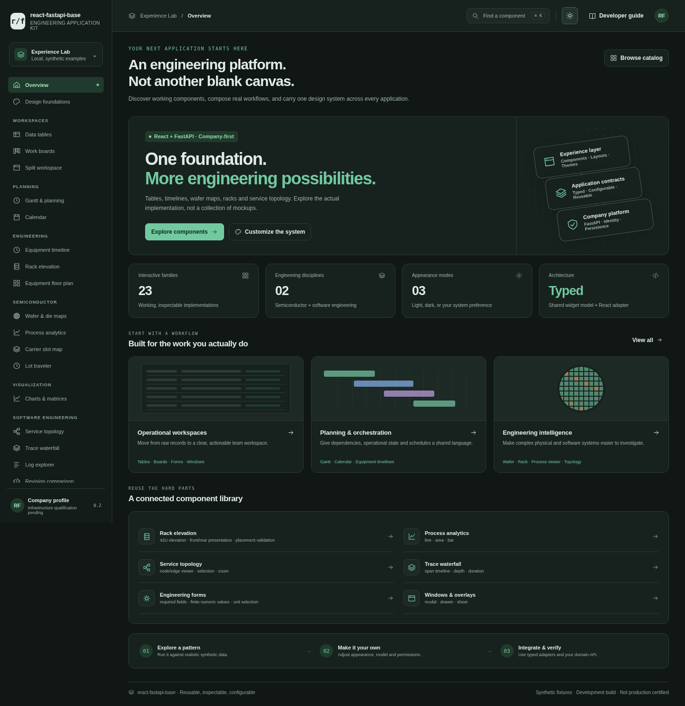

# react-fastapi-base
## A working engineering component lab and React/FastAPI template

**0.2.0-lab — development release, not production certified.**

Explore 23 interactive engineering widget families in a responsive, light/dark web application. The repository also retains the tested FastAPI/SQLite reference backend, React application source, a typed React widget adapter, generators, operator tooling, and the full unfinished platform scope. It is not SysGrid, and SysGrid was not modified.



## Open the working web application now

Unzip this repository, open Terminal in its folder, and run:

```bash
python3 dev lab
```

Open **http://127.0.0.1:4173**. Stop the local server with **Ctrl+C**.

Python 3.10+ is needed for this standalone launcher. No npm, database, login, internet access, or company credentials are needed to explore the shipped compiled Lab. This release was executed on Linux, not on macOS; the macOS commands and CI job are supplied but not certified here.

The Lab is a real interactive DOM/SVG web application compiled from strict TypeScript. **It is not the React host build.** React integrations use the same widget implementation through `EngineeringWidget`. Full React/Vite/Storybook dependency installation and browser integration remain unverified.

## Explore

| Area | Working examples |
|---|---|
| Data operations | Searchable/filterable/sortable/paginated/grouped table, selection and local bulk archive, board with pointer and keyboard moves |
| Planning | Dependency-validated Gantt, calendar event creation, equipment state timeline |
| Engineering | Rack elevation and collision-aware moves, wafer die map and yield, carrier/slot management, lot traveler, equipment floor plan |
| Analytics | Process trace and explicit limits, categorical bars/donut/heatmap, service topology, trace waterfall |
| Software/workflow | Log search, configuration diff, JSON validation, pipeline status, permissions matrix, notifications |
| Composition | Engineering form, modal/drawer/sheet/full-screen/wizard/confirm examples, resizable split workspace |
| Developer experience | Searchable catalog, command palette, live Theme Studio, usage examples and limitations for each family |

All Lab data is **synthetic**. Edits demonstrate local component behavior; they do not send commands to equipment, deploy software, change company permissions, or persist to the backend. The separate FastAPI reference app supplies durable records, permissions, revision conflicts, audit, history, saved views, CSV exchange and attachments.

## Appearance and customization

Light, dark and system preference are first-class. Change density, corner radius, high-contrast presentation, reduced motion and viewport simulation. Open `#/themes` to export appearance settings. Each demo also exposes read-only/loading/empty/error states and its typed configuration contract.

- Lab shell/navigation: `experience-lab/src/app.ts`, `registry.ts`.
- Lab appearance: `experience-lab/public/styles.css`, `theme-init.js`.
- Widget data: public `model` / `configure()` contracts and the React adapter.
- Presentation options: `experience-lab/src/presentation.ts` (including schedule dates, rack capacity/power and wafer labels).
- React app composition: `frontend/src/app/`, `frontend/src/features/`, `frontend/src/theme/`.
- Backend app configuration/features: `backend/app/config/`, `backend/app/features/`.
- Public, non-secret runtime configuration: `frontend/public/runtime-config.json`.

See [Experience Lab guide](docs/EXPERIENCE_LAB.md), [component coverage](docs/COMPONENT_COVERAGE.md), and [customization](docs/CUSTOMIZATION.md).

## Full React + FastAPI application

This path needs Python 3.13, Node 22.12+ in the Node 22 line and package-registry access. It is **not** the zero-install Lab path.

```bash
python3 dev setup
python3 dev seed-demo
python3 dev start
```

Frontend: http://127.0.0.1:5173; API: http://127.0.0.1:8000. The `/lab` route embeds the Lab. `setup` resolves the missing frontend lock on its first installation; its candidate dependency pins still need clean-install review. **Do not interpret this as a verified React build.**

Seeding uses a new local data directory and refuses existing data. `start` never resets data. Local demo identity is not corporate authentication. Production company configuration fails closed without operator qualification.

To build once dependencies are available: `cd frontend && npm run build`. The Node publisher is `frontend/server.mjs` and the FastAPI publisher is `backend/run.py` or `app.main:app`. Do not substitute development identity for corporate production authorization.

## Verification

```bash
# Recompile the Lab when changing TypeScript (compiler required).
python3 dev lab-build

# Native widget tests; default mode tests a real local HTTP server.
python3 dev test-lab

# Full platform release checks; currently returns nonzero for missing requirements.
python3 dev verify
```

The current environment required an explicitly recorded **in-memory browser harness** for compiled widget tests because its managed browser blocks direct localhost navigation. The HTTP/static-server and actual Uvicorn API tests ran separately. These results do not certify React integration, all accessibility criteria, macOS or the corporate PaaS.

Current machine-readable evidence:
- [Widget verification](evidence/current/lab/verification.json)
- [Full platform verification](evidence/current/full-stack/verification.json)
- [Screenshots](evidence/current/browser/)

## Generate a separate application

```bash
python3 dev create ../equipment-app --id equipment-app --name "Equipment workspace" --theme clarity
```

The destination must not exist. Test data, local credentials, old evidence and checkpoints are excluded. The generator currently creates the reference app, **not all planned specialized workspace archetypes**. Platform upgrades have a conflict-aware dry-run planner; safe apply/rollback remains unfinished.

## What is not complete

The expanded inventory retains **605 required scope entries** (components, variants and platform services), not 605 completed components. This release implements 23 provisional widget families. Full React/Storybook validation, complete advanced Gantt/grids/SPC/domain packs, API bindings for the Lab, rigorous accessibility/security/performance certification, full SysGrid extraction/parity, safe upgrade application, fresh macOS installation and company-environment qualification remain open.

Read [Release Status](docs/RELEASE_STATUS.md) before using anything against real data. No production approval, SEMI compliance, WCAG conformance or manufacturing calculation certification is claimed.

## Documentation

[Mac quickstart](docs/MAC_QUICKSTART.md) · [Experience Lab](docs/EXPERIENCE_LAB.md) · [Master design](docs/MASTER_DESIGN.md) · [68-domain ledger](docs/REQUIREMENTS_STATUS.md) · [605-item catalog](docs/COMPONENT_COVERAGE.md) · [Testing](docs/TESTING.md) · [Company qualification](docs/COMPANY_QUALIFICATION.md) · [Deployment](docs/DEPLOYMENT.md) · [Recovery](docs/RECOVERY.md) · [Next implementation](docs/NEXT_IMPLEMENTATION.md)
